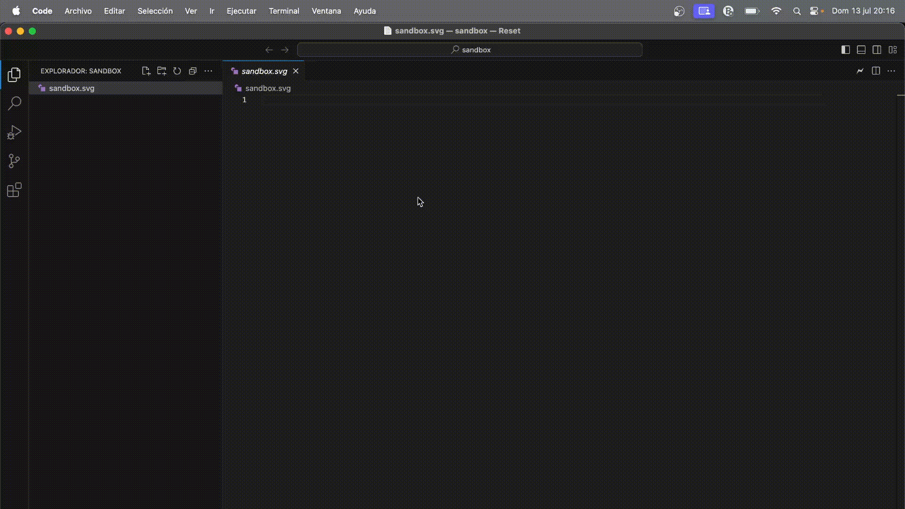

# SVGL-VSCode

## Overview

The SVGL-VSCode extension integrates the robust SVG library from SVGL.app directly into Visual Studio Code, allowing users to search, select, and insert SVG graphics into their projects seamlessly. This extension simplifies the workflow for developers and designers by providing quick access to a vast collection of SVGs without leaving the IDE.

## Features

- **Search SVGs:** Quickly search for SVGs by typing the name or keywords related to the SVG you need and will be inserted in your code.
- **Multi-language Support:** Currently supports English and Spanish, adapting automatically to the language settings of your VSCode environment.

## Installation

Install SVGL from the Visual Studio Code Marketplace or search for "svgl" in the VSCode Extensions view (`Ctrl+Shift+X`).

## Usage

1. **Open the Command Palette** (`Ctrl+Shift+P`).
2. **Type "Insert SVG"** and select the `Insert SVG` command.
3. **Enter the SVG name** or related keywords in the input box that appears.
4. **Select the SVG** you wish to use from the quick pick menu.
5. The SVG will be **inserted at your cursor's current position** in the active editor.

## Contributing

Contributions are welcome! Feel free to open issues or submit pull requests on our GitHub repository for bug fixes, features, or documentation improvements.

## Feedback

If you encounter any problems or have suggestions, please open an issue on the GitHub repository. We appreciate your feedback to help improve this extension!

## License

This project is licensed under the MIT License - see the [LICENSE](LICENSE) file for details.

## Acknowledgements

- Thanks to the SVGL.app team for providing the SVG library and API that powers this extension.
